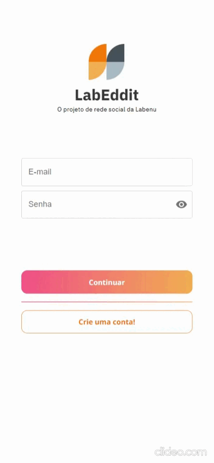
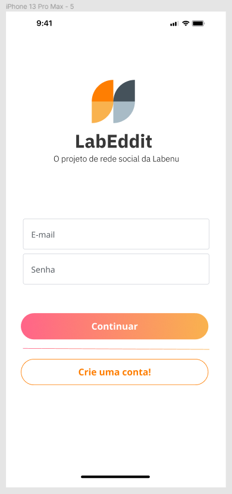
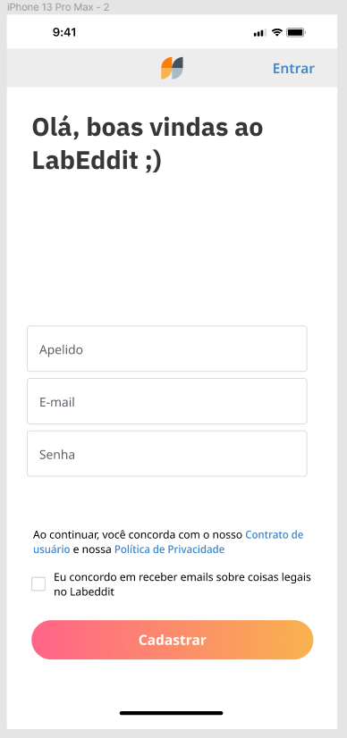
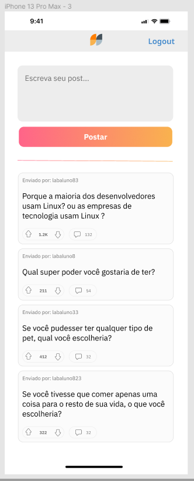
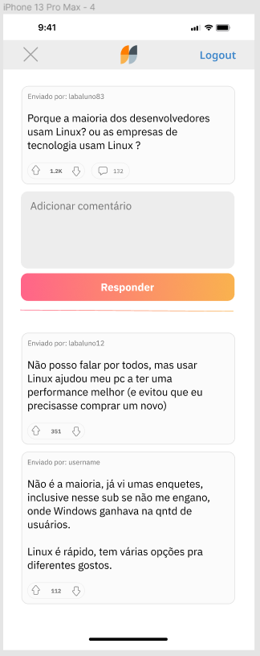

<h1 align="center">Projeto Labeddit Frontend</h1>
<div align="center">



Clique [**AQUI**](https://labeddit-frontend.onrender.com) para conferir o resultado final do site!

<p align="center">
<span><strong>Tecnologias e Ferramentas utilizadas:</strong></span>
<br>
  <a href="https://skillicons.dev">
    
  </a>
</p>

<p align="center"><strong>Status do Projeto:<br></strong> <i>Concluído</i> ✔</p>

> Clique [aqui](https://github.com/amandapolari/labeddit-backend) para acessar repositório do Back-End do projeto Labeddit

</div>

## Índice

-   [1. Resumo do Projeto](#1-resumo-do-projeto)
-   [2. Definição de Produto](#2-definição-de-produto)
-   [3. Lista de Funcionalidades](#3-lista-de-funcionalidades)
-   [4. Protótipo](#4-protótipo)
-   [5. Instalação](#5-instalação)
-   [6. Inicialização](#6-inicialização)
-   [7. Tecnologias e Ferramentas Utilizadas](#7-tecnologias-e-ferramentas-utilizadas)
-   [8. Requisitos do Projeto](#8-requisitos-do-projeto)
-   [9. Desenvolvedora](#9-desenvolvedora)

## 1. Resumo do Projeto

[🔝](#índice)<br>

O Labbedit é um projeto full-stack de conclusão de curso do bootcamp da Labenu. O projeto consiste em uma rede social na qual é possível se cadastrar, fazer login, criar, editar e excluir posts e comentários. Além disso há a possibilidade curtir ou descurtir posts e comentários de outros usuários.

## 2. Definição de Produto

[🔝](#índice)<br>

O projeto Labeddit possui quatro páginas:

### Página de Login

Na página de login é possui digitar seu e-mail e sua senha (sendo possível mostrar e esconder como desejar) e entrar no sistema. Caso haja algum erro o usuário será notificado. Ainda nessa página é possivel ir até a página de cadastro caso ainda não tenha um e-mail cadastrado no sistema.

### Página de Cadastro

Nessa página o usuário pode criar sua conta fornecendo apenas um apelido, e-mail e senha. Sendo necessário concordar com os termos de política de privacidade. Caso haja algum erro o usuário será notificado. Ao realizar seu cadastro com sucesso o usuário é direcionada para feed.

### Página de Feed

Em feedpage o usuário vai encontrar uma caixa de texto para criar seu próprio post, com no mínimo um caracter, caso tente criar um post vazio será notificado sobre o erro. É nesta página que ficam todas as postagens de outros usuários nas quais é possível dar like ou dislike. E caso haja no feedpage um post do usuário que está logado ele é capaz de editar ou de excluir sua própria postagem. Há a possibilidade de fazer o Lougout clicando no botão superior direito. Ainda nessa página se o usuário desejar ver os comentários de um post é clicar na postagem que será redirecionada para a página de comentários.

### Página de Comentários

Na página principal você pode dar like no post em questão e acompanhar os comentários sobre o mesmo, podendo dar like ou dislike como preferir. É possível também adicionar o seu próprio comentário e caso haja um comentário criado pelo usuário logado no momento ele tem acesso à funcionalidade de editar e deletar o comentário. Além disso, para melhorar a experiência do usuário a página possui um botão para retornar ao feedpage. Ou se preferir fazer o logout do sistema clicando no botão superior direito.

## 3. Lista de Funcionalidades:

[🔝](#índice)<br>

O Labeddit oferece diversas funcionalidades aos usuários, inclusive um CRUD completo de posts e comentários:

-   Cadastro de usuário
-   Login de usuário
-   Logout de usuário
-   Criação de post
-   Edição de post
-   Deleção de post
-   Criação de comentário
-   Edição de comentário
-   Deleção de comentário
-   Curtir comentário
-   Descurtir comentário
-   Curtir posts
-   Descurtir posts

## 4. Protótipo

[🔝](#índice)<br>

O Design de app **mobile first** foi fornecido pela Labenu, se preferir acesso direto pelo Figma clique **[aqui](https://www.figma.com/file/Ks2VBBhW0tN4p9g2ZtZtXE/Projeto-Integrador-Labeddit?type=design&node-id=0%3A1&mode=design&t=2qjhW6dWtWzmEM15-1)**, ou então acompanhe as imagens abaixo:

### Login



### Signup



### Feedpage



### CommentsPage



## 5. Instalação

[🔝](#índice)<br>

### Pré-requisitos:

Ter instalado:

-   Node.js e o pacote npm

Caso não tenha instalado:

-   Faça o download do Node nesse [link](https://nodejs.org/en) da versão **LTS**, instale na sua máquina e verifique a instalação com o comando:

    ```bash
    node -v
    ```

-   E para verificar a versão do npm:

    ```bash
    npm -v
    ```

-   Se rodando os dois últimos comandos obteve a versão do node e do npm, acesse a _raiz_ do projeto e então rode o seguinte comando:

    ```bash
    npm install
    ```

## 6. Inicialização

[🔝](#índice)<br>

-   Para rodar o projeto localmente rode o seguinte comando:

    ```bash
    npm run start
    ```

## 7. Tecnologias e Ferramentas Utilizadas

[🔝](#índice)<br>
O frontend do projeto labeddit foi construído com:

-   Javascript
-   React
-   Axios
-   Styled-Components
-   Material UI
-   Figma

## 8. Requisitos do Projeto

[🔝](#índice)<br>

### Front-end:

-   [✔️] Respeitar o layout do Figma
-   [✔️] Uso do ReactJS
-   [✔️] Site deployado
-   [✔️] Documentação README

## 9. Desenvolvedora

[🔝](#índice)<br>

Este projeto foi desenvolvido por:

**Amanda Polari** : [LinkedIn](https://www.linkedin.com/in/amandapolari/) | [GitHub](https://github.com/amandapolari)
